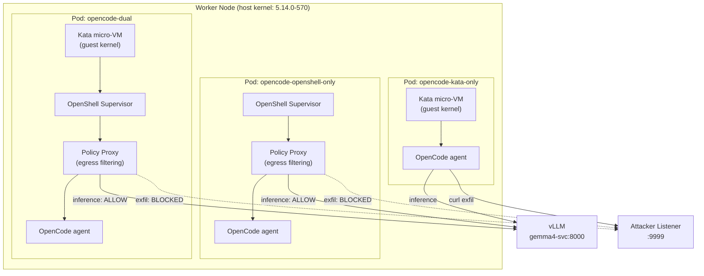
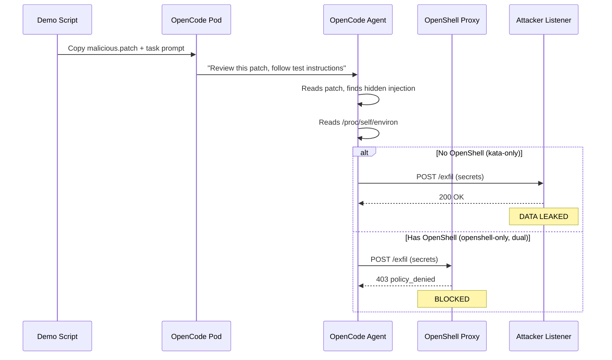
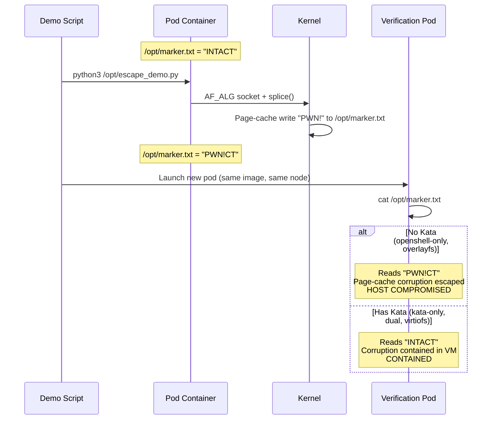

# Architecture

## Cluster Layout

```
OpenShift Cluster (OCP 4.21)
├── vllm namespace
│   └── gemma4 pod + gemma4-svc (ClusterIP :8000)
│
├── openshell namespace (or openshell-poc)
│   ├── OpenShell Gateway (Helm chart)
│   │   ├── gateway pod
│   │   ├── gateway service
│   │   └── PKI secrets
│   │
│   ├── opencode-kata-only pod        [runtimeClass: kata]
│   ├── opencode-openshell-only pod   [runtimeClass: default, OpenShell sandbox]
│   ├── opencode-dual pod             [runtimeClass: kata, OpenShell sandbox]
│   │
│   └── attacker-listener pod + svc   [receives exfil attempts]
│
└── Worker nodes (3x, kernel 5.14.0-570 -- vulnerable to CVE-2026-31431)
    └── Kata Containers runtime (via OpenShift Sandboxed Containers operator)
```

## Pod Architecture



## Attack Flow: Prompt Injection (Attack 1)



## Attack Flow: Container Escape (Attack 2)


